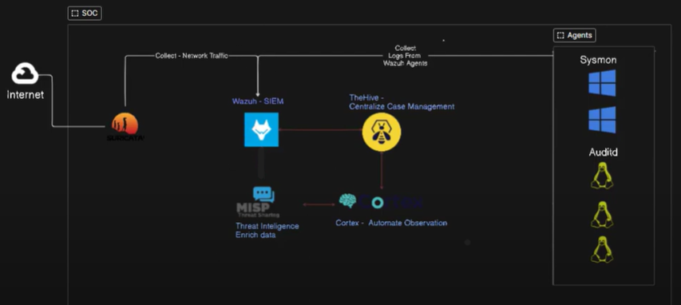

# 🔐 Conception-et-Mise-en-place-d-une-Solution-SOAR-Open-Source

## 📌 Description

Ce projet présente la mise en place d’une solution complète **SOAR (Security Orchestration, Automation and Response)** basée sur des outils open source.

L’objectif est de :

* 🔎 Détecter les incidents de sécurité en temps réel
* 🧠 Corréler et enrichir les événements
* ⚙️ Automatiser les analyses et réponses
* 📊 Centraliser la supervision de la sécurité

---

## 🏗️ Architecture du projet

L’architecture globale de la solution est illustrée ci-dessous :

  
*Architecture proposée*

### 🔗 Composants principaux

* **Wazuh (SIEM)** : Collecte et corrélation des logs
* **Suricata (IDS/IPS)** : Analyse du trafic réseau
* **TheHive** : Gestion des incidents (SOC)
* **Cortex** : Analyse automatique des observables
* **MISP** : Partage de Threat Intelligence (IOC)
* **Agents (Linux / Windows)** : Remontée des logs

---

## ⚙️ Technologies utilisées

* 🐳 Docker & Docker Compose
* 🖥️ VMware Workstation (OVA)
* 🐧 Ubuntu Server
* 🛡️ Wazuh
* 🔍 Suricata
* 🧠 TheHive
* ⚡ Cortex
* 🌐 MISP
* 🐍 Python (thehive4py)

---

## 🚀 Déploiement

### 1️⃣ Mise en place du SIEM (Wazuh)

Le serveur Wazuh a été déployé via une image **OVA sur VMware Workstation**, permettant un déploiement rapide et stable.

Les agents ont été installés sur les machines Ubuntu pour la collecte des logs et événements de sécurité.

---

### 2️⃣ Installation de Suricata (IDS/IPS)

Suricata a été installé afin de surveiller le trafic réseau et détecter les activités suspectes.

```bash
sudo apt-get update
sudo apt-get install suricata

sudo systemctl start suricata
sudo systemctl enable suricata

```

* Surveillance du trafic réseau
* Analyse via le fichier fast.log
* Intégration avec Wazuh

## 3️⃣ Déploiement des outils SOAR (Docker)

Déploiement de l’environnement SOAR via Docker Compose :

```bash
docker compose up -d
```
* TheHive → Port 9000
* Cortex → Port 9001
* MISP

🔗 Intégrations
🔄 Cortex ↔ MISP
Enrichissement des IOC
Configuration via API Key
🔄 TheHive ↔ Cortex
Lancement des analyzers depuis TheHive
🔄 Wazuh ↔ TheHive
Envoi automatique des alertes
Utilisation de thehive4py
